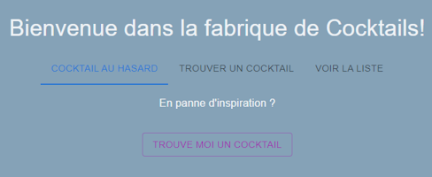
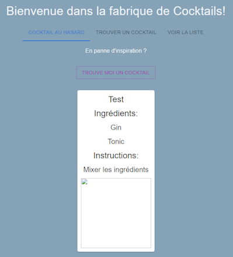
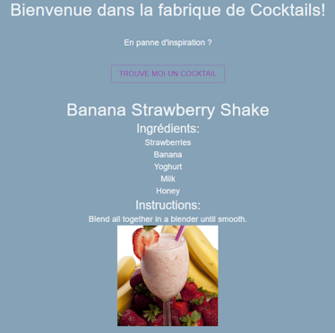
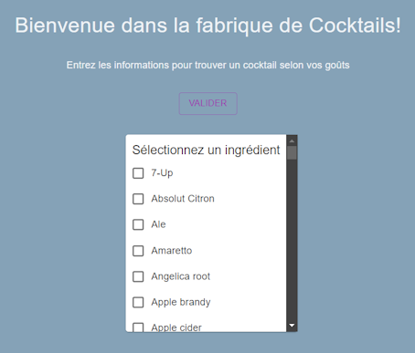
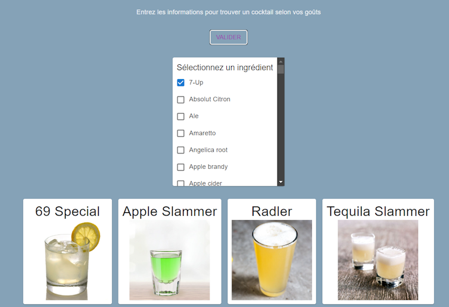
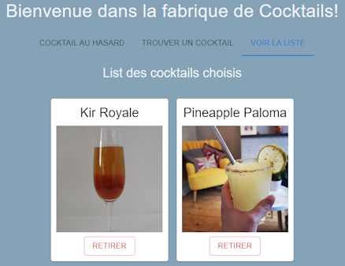
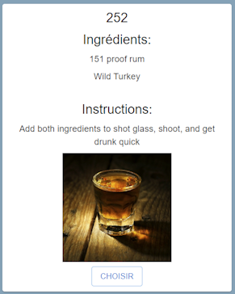
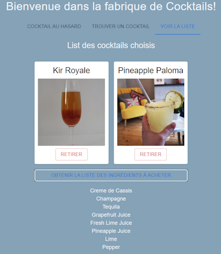
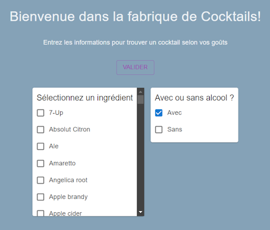

# Comment bien préparer sa soirée ?

Dans ce test technique nous allons développer une application pour choisir et réaliser des cocktails afin de préparer une soirée parfaite.
Le but de l'exercice est de faire une maquette protype, on se concentreta durant le temps impartis de 1h sur l'aspect technique et fonctionnelle (l'aspect visuel n'est pas important).

### 1. Créer une page pour afficher la recette d'un cocktail choisi au hasard

#### 1.1 Remplir la page 'Cocktail au Hasard'

L'application contient un tab component avec 3 entrées. Dans cette partie on veut simplement que le composant [RandomCocktail](/src/components/1_RandomCocktail/index.tsx) s'affiche lorsque la section 'Cocktail au Hasard' est sélectionnée, comme sur l'image ci-dessous:

#### 1.2 Afficher les données d'un cocktail

Dans un second temps nous allons ajouter à cette page le composant [CocktailCard](/src/components/CocktailCard/index.tsx) et le compléter pour qu'il affiche les données d'un cocktail.
On utilisera des données hardcodés que l'on passera en props pour vérifier l'affichage du composant.
Le résulta devra ressembler par exemple à:

#### 1.3 Cabler les données à l'API

Dans cette 3ème étape, nous allons cabler le bouton pour envoyer un appel API et récupérer de vrais données de cocktail choisi aléatoirement.
La définition de l'API est détaillée à cette addresse: https://www.thecocktaildb.com/api.php

Faites en sorte d'afficher la description du cocktail contenue dans la reponse à la requête API (voir ci dessous)

### 2. Créer un formulaire pour trouver un cocktail selon critères

Dans cette partie nous allons créér un formulaire pour trouver un cocktail à notre goût. Implémenter une nouvelle page avec le composant [FindCocktail](/src/components/2_FindCocktail/index.tsx) contenant une liste de tous les ingrédients disponible, l'utilisateur doit pouvoir sélectionner un seul ingrédient. On pourra s'inspirer de l'image ci-dessous:

Lors du click sur le bouton **Valider** il faudra fait appel à l'API pour récupérer uniquement la liste des cocktails qui contiennent l'ingrédient choisi et les afficher, comme ci-dessous:

**Questions bonus:**
* Trier la liste des ingrédients par ordre alphabéthique

### 3. Ajouter la possibilité de sauvegarder un cocktail pour la soirée

#### 3.1 Afficher la liste des cocktails choisis

Dans cette partie nous allons permettre à l'utilisateur de naviguer sur les deux pages et lui offrir la possibilité d'ajouter les cocktails choisis en favoris, qui seront créés pour la soirée. Une troisième page permettra de voir la liste des cocktails choisis et d'obtenir la liste des ingrédients (voir image ci-dessous comme example):

Pour ce faire il faudra ajouter un bouton **Choisir** pour chaque cocktail permettant de l'ajouter à la liste:

Dans la page listant tous les cocktails choisis on ajoutera aussi un bouton permettant de retirer un cocktail de la liste.

Afin de garder en mémoire la liste des cocktails choisis on utilisera **redux** qui a déjà été configuré dans ce projet. Il faudra compléter le reducer créé dans `src/redux/slices/cocktailsSlice.ts`.

#### 3.2 Obtenir la liste des ingrédients

On voudra maintenant générer la liste de tous les ingrédients nécessaires pour la réalisation de tous ces cocktails, ajouter un bouton qui affichera lors du click la liste de tous les ingrédients:

### 4. Bonus: Ajouter une option dans le formulaire en #2 pour choisir des cocktails avec ou sans alcool

Ajouter une option pour trier selon les cocktails avec ou sans alcool (N.B: L'API ne permet pas de filtrer à la fois sur un ingrédient et sur le type de boisson (avec alcool ou non), il faudra trouver un moyen de procéder autrement)

**Questions bonus:**
* Avez vous des idées pour améliorer cette API ?
* Voyez vous des idées d'amélioration de l'architecture du projet ?
* Voyez vous des idées pour optimiser le projet ?

